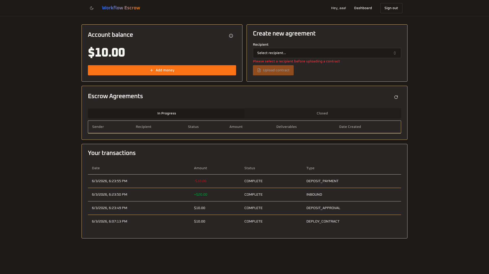

# Workflow Escrow Refund Protocol

Automate escrow-backed freelance agreements with AI-powered work validation using USDC on Arc testnet. This sample application uses Next.js, Supabase, Circle Developer Controlled Wallets, and OpenAI to demonstrate an end-to-end escrow workflow — from contract creation and deposit, through AI-validated deliverable submission, to fund release or refund.



> [!WARNING]
> **The onramp defaults to sandbox, and leaving it that way is deliberate.**
> `ONRAMP_API_BASE_URL` and `NEXT_PUBLIC_ONRAMP_WIDGET_BASE_URL` are set to
> Circle's sandbox endpoints in `.env.example`. If either is unset, empty, or
> removed, the app falls back to Circle's production endpoints on mainnet, where
> **every purchase charges a real payment method** — and delivers to a chain the
> Arc Testnet escrow wallet does not exist on. Setting only one of them is
> refused at startup rather than run in a broken half-state.

## Table of Contents

- [Prerequisites](#prerequisites)
- [Getting Started](#getting-started)
- [How It Works](#how-it-works)
- [Environment Variables](#environment-variables)
- [User Accounts](#user-accounts)

## Prerequisites

- **Node.js v22+** — Install via [nvm](https://github.com/nvm-sh/nvm)
- **Supabase CLI** — Install via `npm install -g supabase` or see [Supabase CLI docs](https://supabase.com/docs/guides/cli/getting-started)
- **Docker Desktop** — [Install Docker Desktop](https://www.docker.com/products/docker-desktop/)
- **[ngrok](https://ngrok.com/)** — For local webhook testing
- Circle Developer Controlled Wallets **[API key](https://console.circle.com/signin)** and **[Entity Secret](https://developers.circle.com/wallets/dev-controlled/register-entity-secret)**
- **[OpenAI API key](https://platform.openai.com/api-keys)** — Used for AI-powered work validation
- Circle **Onramp Kit key** — Create one in the [Circle Developer Console](https://console.circle.com/api-keys). The kit ships from Circle's private Cloudsmith registry, so `npm install` needs `CLOUDSMITH_TOKEN` exported in your shell.

## Getting Started

1. Clone the repository and install dependencies:

   ```bash
   git clone git@github.com:akelani-circle/workflow-escrow-refund-protocol.git
   cd workflow-escrow-refund-protocol
   export CLOUDSMITH_TOKEN=<your-token>
   npm install
   ```

   `.npmrc` points the `@crcl-main` scope at Circle's private registry;
   everything else still resolves from npmjs.

2. Set up environment variables:

   ```bash
   cp .env.example .env.local
   ```

   Then edit `.env.local` and fill in all required values (see [Environment Variables](#environment-variables) section below). Leave `NEXT_PUBLIC_AGENT_WALLET_ID`, `NEXT_PUBLIC_AGENT_WALLET_ADDRESS`, and `CIRCLE_BLOCKCHAIN` blank — they will be auto-generated in the next step.

3. Generate the agent wallet:

   ```bash
   npm run generate-wallet
   ```

   This creates a Circle developer-controlled wallet and writes the wallet ID, address, and blockchain values into your `.env.local`.

4. Start the database, with Docker Desktop running:

   ```bash
   npx supabase start
   npx supabase migration up
   ```

   The output of `npx supabase start` displays the Supabase URL and API keys needed for your `.env.local`.

5. Start the development server:

   ```bash
   npm run dev
   ```

   The app will be available at `http://localhost:3000`.

6. Set up Circle Webhooks (for local development):

   In a separate terminal, expose your local server:

   ```bash
   ngrok http 3000
   ```

   Copy the HTTPS URL from ngrok and configure a webhook in the Circle Console:
   - Navigate to [Circle Console → Webhooks](https://console.circle.com/webhooks)
   - Add a new webhook endpoint: `https://your-ngrok-url.ngrok.io/api/webhooks/circle`
   - Keep ngrok running while developing to receive webhook events

## How It Works

- Built with [Next.js](https://nextjs.org/) and [Supabase](https://supabase.com/)
- Uses [Circle Developer Controlled Wallets](https://developers.circle.com/wallets/dev-controlled) for USDC escrow transactions on Arc testnet
- Smart contracts (EIP-712 Refund Protocol) deployed and managed via `@circle-fin/smart-contract-platform`
- [OpenAI](https://platform.openai.com/) validates submitted work deliverables against agreement criteria using vision models
- Webhook signature verification ensures secure transaction notifications
- Agent wallet automatically initialized via the `generate-wallet` script
- **Add money** opens Circle's hosted onramp in a popup via [Onramp Kit](https://developers.circle.com/), scoped to USDC on Arc. The session is minted server-side against the signed-in user's own wallet, so the browser never names the destination address
- Real-time UI updates powered by Supabase Realtime subscriptions

## Environment Variables

Copy `.env.example` to `.env.local` and fill in the required values:

```bash
# Deployment URL
VERCEL_URL=http://localhost:3000
NEXT_PUBLIC_VERCEL_URL=http://localhost:3000

# Supabase
NEXT_PUBLIC_SUPABASE_URL=
NEXT_PUBLIC_SUPABASE_ANON_KEY=

# USDC Smart Contract
NEXT_PUBLIC_USDC_CONTRACT_ADDRESS=

# Agent Wallet (auto-generated by npm run generate-wallet)
NEXT_PUBLIC_AGENT_WALLET_ID=
NEXT_PUBLIC_AGENT_WALLET_ADDRESS=

# Circle
CIRCLE_API_KEY=
CIRCLE_ENTITY_SECRET=
CIRCLE_BLOCKCHAIN=

# OpenAI
OPENAI_API_KEY=

# Circle Onramp Kit (sandbox)
ONRAMP_KIT_KEY=
ONRAMP_API_BASE_URL=https://api-test.circle.com
NEXT_PUBLIC_ONRAMP_WIDGET_BASE_URL=https://onramp-sandbox.arc.io
```

| Variable | Scope | Purpose |
| --- | --- | --- |
| `VERCEL_URL` | Server-side | Base URL of the deployment (e.g., `http://localhost:3000`). |
| `NEXT_PUBLIC_VERCEL_URL` | Public | Public-facing base URL for client-side usage. |
| `NEXT_PUBLIC_SUPABASE_URL` | Public | Supabase project URL. |
| `NEXT_PUBLIC_SUPABASE_ANON_KEY` | Public | Supabase anonymous/public key. |
| `NEXT_PUBLIC_USDC_CONTRACT_ADDRESS` | Public | USDC token contract address on the target blockchain. |
| `NEXT_PUBLIC_AGENT_WALLET_ID` | Public | Circle wallet ID for the escrow agent. Auto-generated. |
| `NEXT_PUBLIC_AGENT_WALLET_ADDRESS` | Public | Wallet address for the escrow agent. Auto-generated. |
| `CIRCLE_API_KEY` | Server-side | Circle API key for wallet and contract operations. |
| `CIRCLE_ENTITY_SECRET` | Server-side | Circle entity secret for signing transactions. |
| `CIRCLE_BLOCKCHAIN` | Server-side | Blockchain network identifier (e.g., `ARC-TESTNET`). Auto-generated. |
| `OPENAI_API_KEY` | Server-side | OpenAI API key for AI-powered work validation. |
| `ONRAMP_KIT_KEY` | Server-side | Circle Onramp Kit key, as `KIT_KEY:<keyId>:<keySecret>`. Must match the environment the base URLs point at. |
| `ONRAMP_API_BASE_URL` | Server-side | Circle API endpoint for the onramp. `https://api-test.circle.com` for sandbox. Unset means production. |
| `NEXT_PUBLIC_ONRAMP_WIDGET_BASE_URL` | Public | Hosted onramp widget endpoint. `https://onramp-sandbox.arc.io` for sandbox. Unset means production. |

## User Accounts

### Default Account

On first visit, sign up with any email and password. The first user created can act as both a depositor (client) and a beneficiary (freelancer) across different agreements.

### Signup Rate Limits

Supabase limits email signups to **2 per hour** by default (unless custom SMTP is configured). If you hit an "email rate limit exceeded" error during testing:

Email verification is handled by the built-in [Inbucket](http://127.0.0.1:54324) mail server — check it to confirm signups. The rate limit can be adjusted in `supabase/config.toml` under `[auth.rate_limit]`.

## Security & Usage Model

This sample application:
- Assumes testnet usage only
- Handles secrets via environment variables
- Verifies webhook signatures for security
- Is not intended for production use without modification
